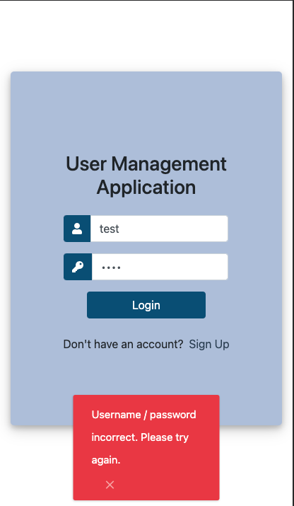
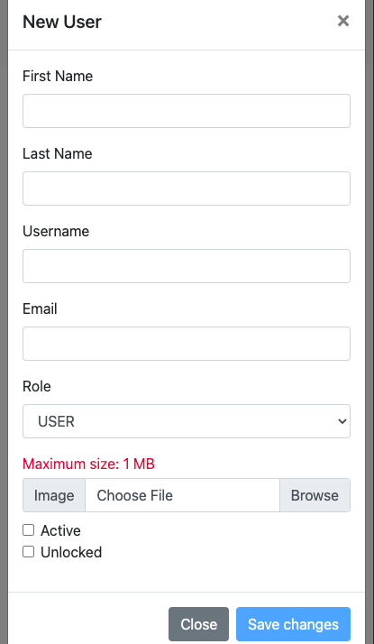

# User Management Client

Web Client to perform CRUD operations on users and reset passwords. 
(Back-End - <a href="https://github.com/spencer-forrest-java/spring-user-management-api">User Management API</a>)
  
For any questions contact me at 
[Spencer Forrest](mailto:spencer.forrest.java@gmail.com?subject=[GitHub]%20User%20Management%20Client).

## Technologies used

1. Angular 11
2. Angular CLI 11
3. Boostrap 4.5

## Description

This application allows logged user with enough credentials to perform CRUD operations on a user. The user will receive
a new automatically generated password by email upon registration or by having their password reset by an admin or a super
admin. 

## Screenshots

### Large Screens

Login Screen

Wrong password / username notification

Account locked notification after 6 failed attempts

Registration form

Admin and Super Admin page - list of users

User page - list of users

Users loaded notification after clicking on the refresh button

User adding form after clicking on the add button

User information appears after clicking on his/her row

User editing form after clicking on his/her edit button

Admin and Super Admin: reset password

Admin and Super Admin: reset password - Email not found notification

Special Admin profile is not allowed to be modified

Super Admin profile page

Admin profile page

Manager profile page

User profile page

### Small Screens (Phone size)

  

  

  

  

  

  

  

## Roles and Authorities

There are 4 authorities (permissions):

* Create a user
* Read a user information
* Update a user
* Delete a user

A user is assigned a role. There are 4 roles in total:

* Super Admin can:
  * Add new users
  * Read users information
  * Update user's information
  * Delete a user
  * Reset a user's password
* Admin can:
  * Add new users
  * Read users information
  * Update user's information
  * Reset a user's password
* Manager can:
  * Read users information
  * Update user's information except:
    * His/her role
* User can:
  * Read users information
  * Update his/her own information except:
    * Active status
    * Locked status
    * His/her role

## More Business Logic

* There is a special super admin with the username "admin".
   
  This user cannot be deleted or updated except for his profile picture.
    
* If a user tries to log in with a correct username but fails 6 times in a row,
   
  the account will be locked. Only a manager, admin or super admin can unlock this account.
    
* Passwords are automatically generated and sent by email to users 
  upon registration or upon resetting it. 
    
* There is a search functionality. It helps to look for a user by first name, last name, username or email.
    
* Unauthorized actions will result in an error being sent by
  <a href="https://github.com/spencer-forrest-java/spring-user-management-api">the backend</a>:
  * For instance, the delete button is intentionally shown for users with the role "admin" even though they do not have
    the "Delete" authority.
  * If an "admin" tries to delete a user, an error message will appear stating that this user does not have enough
    permission to perform this action.
      
    
